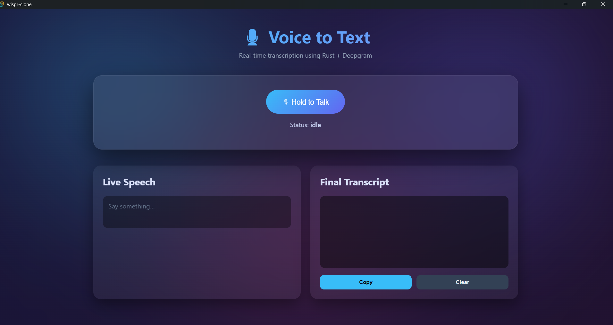

# Tauri + React + Typescript

This template should help get you started developing with Tauri, React and Typescript in Vite.

## Recommended IDE Setup

- [VS Code](https://code.visualstudio.com/) + [Tauri](https://marketplace.visualstudio.com/items?itemName=tauri-apps.tauri-vscode) + [rust-analyzer](https://marketplace.visualstudio.com/items?itemName=rust-lang.rust-analyzer)

# 🎙️ Wispr Clone – Real-Time Voice-to-Text Desktop App

  

  <i>Real-time voice-to-text desktop app built with Tauri, Rust, React & Deepgram</i>

# 🎙️ Wispr Clone – Real-Time Voice-to-Text Desktop App

A **Wispr-style, cross-platform voice-to-text desktop application** built using **Tauri, Rust, React, and Deepgram’s real-time speech recognition API**.

The app uses a **push-to-talk UX**, captures microphone audio on demand, streams it from the frontend to a secure Rust backend, forwards it to Deepgram over WebSockets, and emits **live + final transcripts** back to the UI in real time.

---

## 🚀 Overview

- 🖥️ Cross-platform desktop app (Windows, macOS, Linux) powered by **Tauri**
- ⚛️ React frontend for UI and microphone capture
- 🦀 Rust backend managing WebSocket communication with Deepgram
- 🎧 Push-to-talk recording with real-time transcription
- 📝 Live (interim) + final transcript aggregation
- 📋 Copy & clear transcript controls

---

## ✨ Features

- 🎙️ **Push-to-talk recording** (hold to speak, release to stop)
- ⚡ **Real-time transcription** using Deepgram Streaming API
- 🧠 **Interim & final results** handling
- 🚦 Clear UI feedback:
  - Recording state
  - Microphone permission errors
  - Deepgram / network errors
- 📄 Final transcript textbox with:
  - **Copy to clipboard**
  - **Clear transcript**
- 🎨 Modern animated UI with glassmorphism & motion effects

---

## 🛠️ Tech Stack

### Desktop & Backend
- **Tauri (Rust)**
- **Tokio async runtime**
- **tokio-tungstenite** for WebSocket streaming
- **Serde / serde_json** for message serialization

### Frontend
- **React + TypeScript**
- **Vite**
- **Web Audio APIs** (`getUserMedia`, `MediaRecorder`)

### Speech-to-Text
- **Deepgram Live Transcription API**
- **Nova model**
- **Opus audio streaming**

---

## 📁 Project Structure

